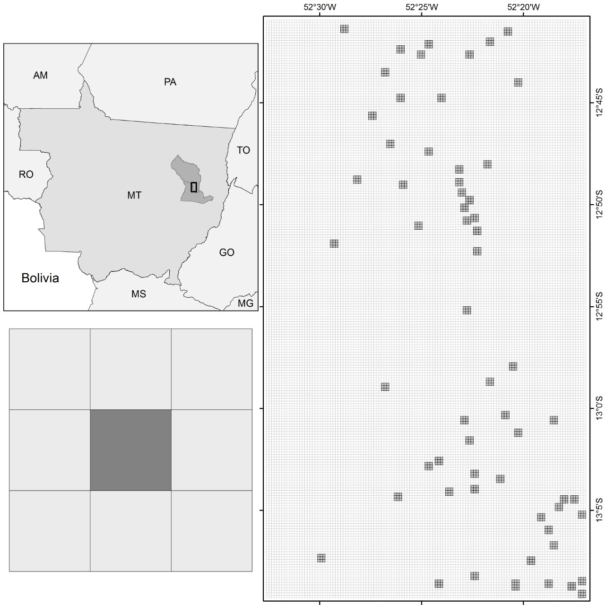

```{r setup, include=FALSE}
knitr::opts_chunk$set(echo = TRUE)
```


### AVALIAÇÃO DO ALGORITMO BFAST, APLICADO A SÉRIES TEMPORAIS NDVI (MOD13Q1), PARA DETECTAR MUDANÇAS DE USO DA TERRA NA REGIÃO NORDESTE DO MATO GROSSO - BRASIL

</br>
<p style="text-align: center;">
*C. Oliveira-Santos[1,2,3], S. S. T. Oliveira[4], A. C. C. Andrade[5], L. R. Baumann[5], L. G. Ferreira[1]*
</p>

<p style="text-align: center;">
[1] Laboratório de Processamento de Imagens e Geoprocessamento – LAPIG/UFG, Brasil </br>
[2] Programa de Pós-Graduação em Ciências Ambientais – CIAMB/UFG, Brasil </br>
[3] Instituto de Pesquisas Ambientais da Amazônia – IPAM, Brasil </br>
[4] Instituto de Informática – INF/UFG, Brasil </br>
[5] Instituto de Matemática e Estatística – IME/UFG, Brasil </br>
</p>

<p style="text-align: center;">
**comissão ?**

</br>
</p>

#### RESUMO

<p style="text-align: center;">
Resumo: cerca de 5 a 10 linhas.

**Palavras chave:** Bfast, Ndvi, Uso do solo, Séries temporais

</br>
</p>

#### ABSTRACT
<p style="text-align: center;">
Abstract: about 5 at 10 lines.

**Keywords:** Bfast, Ndvi, Soil use, Time series

</br>
</p>

#### 1- INTRODUÇÃO
<p style="text-align: justify;">
A gestão eficiente e sustentável de um território implica conhecer seu histórico e as mudanças nele ocorridas ao longo do tempo. Devido ao comportamento dinâmico das alterações na cobertura e uso da terra, principalmente em países de grande extensão territorial e com uma atividade agropecuária representando um forte setor econômico, a aquisição de informações por sistemas de sensoriamento remoto constitui-se em uma importante ferramenta para compreensão desse histórico e análise das mudanças **(Reference)**. Nesse contexto, dentre as informações obtidas por sensoriamento remoto, destaca-se as que constituem séries temporais, visto que estas tornam possível acompanhar processos naturais e antrópicos e detectar mudanças ocorridas no ambiente em determinado período de tempo **(Reference)**.
</p>

<p style="text-align: justify;">
Como as séries temporais de dados da vegetação obtidas por sensoriamento remoto são fortemente influenciadas pelas variações sazonais climáticas, os algoritmos de detecção de mudanças de regimes aplicados a essas séries temporais geralmente não apresentam boa acurácia no processo de detecção de conversões de uso do solo **(Reference)**. Assim, o uso eficaz dessas séries requer métodos automatizados e que levem em conta os componentes sazonal e de tendência da série temporal, e que tenham sensibilidade para detectar mudanças abruptas e graduais. Entre os algoritmos desenvolvidos para esta finalidade, destaca-se o BFAST (Breaks For Additive Seasonal and Trend). Esse algoritmo tem sido utilizado e avaliado em relação à detecção de mudanças de diferentes magnitudes (abruptas e graduais) e mudanças de direção na tendência interanual de alvos de tamanhos variados (Verbesselt et. al. 2010).
</p>

<p style="text-align: justify;">
Em um estudo desenvolvido na região semiárida da Austrália, o BFAST foi analisado quanto  à eficácia para avaliação de padrões nas respostas regionais da vegetação, por meio da detecção de mudanças abruptas na magnitude e direção das tendências de longo prazo *(WATTS et. al. 2014)*. No Brasil, em Minas Gerais, foi analisada a influência do tamanho do alvo na capacidade do BFAST em detectar mudanças graduais e abruptas em séries temporais *(DE CARVALHO et. al. 2015)*. Análises comparativas da eficácia do BFAST em detectar mudanças de uso do solo, por meio de séries temporais de diferentes índices de vegetação, como NDVI e EVI, também tem sido conduzidas em alguns estudos *(ex. DARMAWAN et. al. 2012)*. Entretanto, ainda foi pouco avaliada a eficácia do BFAST, e os impactos de sua parametrização, no caso sazonalidade e H (tamanho mínimo do segmento da série temporal entre duas potenciais mudanças), em detectar mudanças em diversos tipos de conversões de uso da terra.
</p>

<p style="text-align: justify;">
No presente estudo foi avaliada a efetividade do BFAST em detectar mudanças em séries temporais de imagens NDVI (produto MOD13Q1 do sensor MODIS) *(Huete et al., 2002)* para o período compreendido entre os anos 2000 e 2016, em diversos tipos de conversões de uso do solo, com vistas a se determinar a configuração de parâmetros em que o BFAST é mais eficaz, para cada tipo de conversão de uso do solo analisada.

</br>
</p>


```{r introd, echo=TRUE}

```

#### 2- MATERIAL E MÉTODOS
##### 2.1 – Área de estudo

<p style="text-align: justify;">
O presente estudo foi conduzido em uma área de transição entre o Cerrado e a Amazônia, no município de Querência, Mato Grosso, Brasil (**Figura 1**). A região possui baixa variação edafoclimática e apresenta sazonalidade bem definida, com uma estação seca que se estende de maio a setembro e estação chuvosa de outubro a abril. A média histórica da precipitação anual nesta região é de aproximadamente 1800 mm, com chuvas raras e geralmente inferior a 10 mm nos meses de estação seca. A temperatura média anual é de aproximadamente 25 ºC *(BRANDO et. al. 2016)*.
</p>

<!-- **FIGURA 1 (ao final do arquivo / precisa formatar para esse padrão de duas colunas)** -->
<center><figure>
  <p>
  <figcaption>**FIGURA 1** - *Área de estudo, localizada na Mesorregião nordeste de Mato Grosso (a), com destaque para as amostras selecionadas em diferentes classes de uso do solo (b). Em cada amostra foram selecionados 9 pixeis de NDVI (MOD13Q1) do Sensor MODIS (c).*</figcaption>
</figure>
</center>

<p style="text-align: justify;">

</br>
Essa região está inserida em uma fronteira agrícola que tem sido considerada, em alguns estudos, a mais intensa do mundo nos últimos anos, e denominada arco do desmatamento **(Reference Ruth/Macedo)**. Uma das características observadas nesta região é a alta taxa de conversões de uso do solo, cenário favorável ao desenvolvimento do estudo aqui proposto.
</p>


```{r areaEstu, echo=TRUE}

```

##### 2.2 – Desenho amostral
<p style="text-align: justify;">
Foram estabelecidas 62 áreas amostrais, com os respectivos históricos de transições do uso conhecidos. Essas áreas compreenderam seis classes de cobertura do solo: duas classes controles (floresta nativa e floresta plantada, aqui representada por uma área de silvicultura-seringal) e quatro classes com diferentes mudanças de cobertura do solo (conversão de floresta para pastagem, conversão de pastagem para soja, conversão de soja para soja e milho, e conversão de soja para seringal). Cada amostra consistiu em aproximadamente 52 ha, em um quadrado de 750 por 750 metros, correspondendo a uma matriz de 9 pixels do produto MOD13Q1 (**Figura 1**).
</p>


```{r deseAmos, echo=TRUE}

```

##### 2.3 – Análises
<p style="text-align: justify;">
O BFAST é um algoritmo genérico voltado a detecção de múltiplas mudanças nos componentes sazonalidade e tendências de séries temporais. Neste algoritmo, a série temporal é decomposta em três componentes: tendência (Tt), sazonalidade (St), e ruído (et), utilizando o procedimento STL – Seasonal-Trend decomposition para decompor a série temporal. Sua fórmula pode ser expressa como: 

<p style="text-align: center;">
*Yt=Tt+St+et,t=1,...,n(1)                                  (1)*
</p>

</p>

<p style="text-align: justify;">
onde: Yt são os dados observados no tempo t, Tt é o componente de tendência, St é o componente sazonal, e et é o restante do componente ou ruído. As mudanças são detectadas através da identificação de pontos de quebra (alterações graduais ou abruptas) resultantes da análise dos componentes sazonalidade e tendência (Figura 2). 
</p>

<p style="text-align: center;">
FIGURA 2
</p>

<p style="text-align: justify;">
O BFAST pode ser parametrizado quanto (i) ao seguimento mínimo da série temporal entre duas quebras potenciais (H) e (ii) quanto ao tipo de sazonalidade, que pode ser do tipo Harmônica, Dummy ou None (nenhuma) **(Reference pacote R)**. 
</p>

<p style="text-align: justify;">
Os impactos de possíveis ruídos presentes nas séries temporais foram avaliados utilizando o filtro de wavelet. E para reduzir a sensibilidade do BFAST à mudanças de baixa magnitude, geralmente associadas a fatores climáticos, foi desenvolvida e avaliada uma adaptação do algoritmo, denominada BFASTa, a qual não considera o coeficiente angular no processo de detecção de mudanças de regimes na série. Analisou-se também se existem diferenças significativas em se utilizar o centróide ou a média de valores NDVI de cada área amostral.
</p>

<p style="text-align: justify;">
Para as séries temporais de NDVI, considerando o centróide e a média de cada área, os algoritmos BFAST e BFASTa foram executados para séries originais e filtradas com wavelets, com todos os parâmetros de sazonalidade (dummy, nenhuma e harmônica) e variando o H de 6 meses a 5 anos, em intervalos de seis meses, totalizando 240 combinações para cada pixel.

</br>
</p>


```{r analises, echo=TRUE}

```

#### 4- RESULTADOS E DISCUSSÃO

<p style="text-align: justify;">
O uso de diferentes parâmetros de sazonalidade e também, o uso de centróide ou a média de NDVI não apresentaram efeito significativo na eficácia do método (Figura 3 - Ana/Histograma e teste), de modo que para as análises seguintes foi considerada a sazonalidade harmônica, que é o parâmetro de sazonalidade padrão do algoritmo, e o NDVI do centróide, que tem menor custo computacional. Um dos fatores que podem ter contribuído para estes resultados é o fato de a área ser considerada homogênea, tanto em suas características edáficas e climáticas, quanto em sua composição espacial.
</p>

<p style="text-align: center;">
FIGURA 3
</p>

<p style="text-align: justify;">
O parâmetro H, o filtro wavelet e o BFASTa apresentaram forte impacto sobre a eficácia do algoritmo em detectar mudanças nas séries temporais de NDVI (Figura 4 - Ana/Histograma e teste). Quanto menor o H, maior a sensibilidade do método à mudanças de pequena magnitude. Assim, o número de mudanças detectadas diminuiu com o aumento do H (H(1 ano)  = 277  e H(5 ano) = 58). A detecção de mudanças nas séries filtradas com wavelets foi 65% menor que nas séries originais, o que deve estar relacionado ao fato de a suavização da série remover ruídos, reduzindo a detecção de mudanças de baixa magnitudes.
</p>

<p style="text-align: center;">
FIGURA 4
</p>

<p style="text-align: justify;">
Nas áreas controles, floresta e seringal, onde não houveram mudanças antrópicas durante o período avaliado, o algoritmo apresentou boa acurácia. Para a floresta, a eficácia média foi de 98%, havendo alguns erros de comissões para os H de seis meses e um ano, provavelmente relacionadas a variações na sazonalidade climática, ou a ruídos, haja vista que o BFAST para a série filtrada apresentou 100% de eficácia (Figura 5 - Ana/Histograma e teste). Para o seringal, a eficácia foi menor, havendo um maior número de falsos positivos, onde novamente o BFAST com as séries filtradas foi mais eficiente (83%), sugerindo que ao considerar o coeficiente angular, o algoritmo se torna mais robusto a variações no clima. Essas áreas de seringa tem alta amplitude de sazonalidade no NDVI, comparada a floresta nativa, pois apresentam alta deciduidade, perdendo a maior parte de suas folhas durante o período de seca, o que contribui para detecção de falsos positivos em combinações do algoritmo mais sensíveis às mudanças de baixa magnitude. 
</p>

<p style="text-align: center;">
FIGURA 5
</p>

<p style="text-align: justify;">
Nas áreas com conversões de uso, os algoritmos foram menos eficazes, sendo afetados principalmente por erros de comissão. A probabilidade de uma mudança detectada ser verdadeira variou em função do tipo de conversão e dos parâmetros já descritos.
As melhores combinações de parâmetros observadas foram; (1) para mudanças de magnitude alta como transição floresta - pastagem: BFASTa + H(alto) + Wavelets, (2) mudanças de magnitude média como transição pastagem - soja: BFASTa + H(baixo - médio) + Wavelets e (3) mudanças de magnitude baixa como transição soja - soja e milho: BFASTa + H( médio) + Wavelets.

</br>
</p>


```{r resuDisc, echo=TRUE}

```

#### 5- CONCLUSÕES

<p style="text-align: justify;">
Com esse estudo, concluímos que é possível parametrizar o BFAST em uma combinação que aumenta substancialmente sua eficácia em detectar mudanças de regimes em séries temporais de imagens NDVI (MOD13Q1).
</p>

<p style="text-align: justify;">
Os parâmetros de sazonalidade e o uso de séries temporais de pixel ou séries médias de áreas não afetam o desempenho do método; vale ressaltar que as áreas aqui analisadas apresentam alto grau de homogeneidade espacial e edafoclimática. 
</p>

<p style="text-align: justify;">
A suavização da série temporal, com filtro wavelet, o aumento do H (segmento mínimo entre duas mudanças potenciais) e o uso do BFASTa resultam em maior eficácia do algoritmo.
</p>

<p style="text-align: justify;">
Parametrizações que aumentam a probabilidade de acertos na detecção de mudanças apresentam um custo em termos de erros de omissão. Estudos em escala regional pode contribuir para o melhor entendimento da eficácia do algoritmo.

</br>
</p>

```{r conc, echo=TRUE}

```

#### AGRADECIMENTOS (opcional)

<p style="text-align: justify;">
Este estudo se insere no âmbito da iniciativa MapBiomas, apoiada pela The Nature Conservancy.

</br>
</p>

```{r agra, echo=TRUE}

```


#### REFERÊNCIAS BIBLIOGRÁFICAS

<p style="text-align: justify;">
A. Zeileis and C. Kleiber, "Validating multiple structural change models-a case study," Journal of Applied Econometrics, vol 20(5), p.p. 685-690, 2005.
</br>
Arantes, Tássia Borges. "Análise de séries temporais compostas por imagens sintetizadas a partir da fusão de dados MODIS-TM.", 2014. 91p
</br>
BARCELLOS, A. de O.; VILELA, L. Restabelecimento da capacidade produtiva de pastagens por meio da introdução de Stylosantes guianensis cv. Mineirão. Comunicado técnico 65, Embrapa: Planaltina, 2001. 4p.
</br>
DARMAWAN, Yahya; SOFAN, Parwati. Comparison of the vegetation indices to detect the tropical rain forest changes using Breaks for Additive Seasonal and Trend (BFAST) Model. International Journal of Remote Sensing and Earth Sciences (IJReSES), v. 9, n. 1, 2012.
</br>
DE CARVALHO, Nathália Silva; SOUZA, Carolina Gusmão; DE CARVALHO, Luis Marcelo Tavares. Influência da área do objeto no comportamento temporal de áreas de desmatamento, utilizando imagens MODIS/NDVI. Anais XVII Simpósio Brasileiro de Sensoriamento Remoto - SBSR, João Pessoa-PB, Brasil, 25 a 29 de abril de 2015, INPE
</br>
FERREIRA, L. G. et al. Biophysical characteristics and fire occurrence of cultivated pastures in the Brazilian savanna observed by moderate resolution satellite data. International Journal of Remote Sensing, v. 34, n. 1, p. 154–167, 2013
</br>
HONG, Wang et al. Land condition diagnosis based on multi-resolution analysis and wavelet transform. In: Geoscience and Remote Sensing Symposium (IGARSS), 2012 IEEE International. IEEE, 2012. p. 6161-6164.
</br>
HUETE, A ; DIDAN, K ; MIURA, T ; RODRIGUEZ, E.P ; GAO, X ; Ferreira, L.G . Overview of the radiometric and biophysical performance of the MODIS vegetation indices. Remote Sensing of Environment, v. 83, p. 195-213, 2002.
</br>
Jacquin, A.; Sheeren, D.; Lacombe, J.-P. Vegetation cover degradation assessment in Madagascar savanna based on trend analysis of MODIS NDVI time series. Int. J. Appl. Earth Obs. Geoinf. 2010, 12, S3–S10.
</br>
J. Bai and P. Perron, "Computation and analysis of multiple structural change models," Journal of Applied Econometrics, vol 18(1), p.p. 1-22, 2003.
</br>
Verbesselt, J.; Hyndman, R.; Newnham, G.; Culvenor, D. Detecting trend and seasonal changes in satellite image time series. Remote Sens. Environ. 2010, 114, 106–115. 
</br>
WATTS, Laura M.; LAFFAN, Shawn W. Effectiveness of the BFAST algorithm for detecting vegetation response patterns in a semi-arid region. Remote sensing of environment, v. 154, p. 234-245, 2014.
</br>
</p>

```{r refeBibl, echo=TRUE}

```